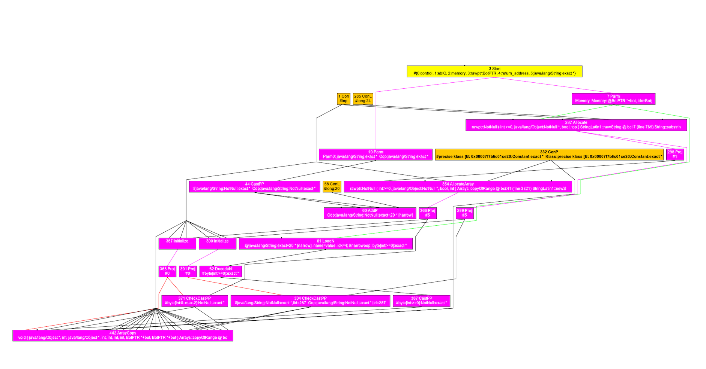
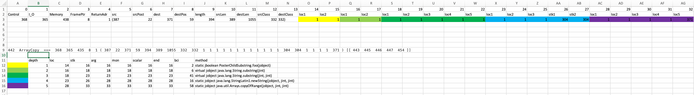

# Java Substring Optimization

## Problem

String.substring creates a new String object since jdk7. Collecting substring objects has been the job of garbage collectors since then. Otherwise, library and application developers may cause memory leaking by holding reference of parent strings.
Sometimes, Java developers just create a temporary substring for a simple pattern matching.

Example-1: read-only substring
```
 public static boolean foo(String s) {
  return s.substring(1).startsWith("a");
 }
```

Example-2: append a substring to StringBuilder
```
 public static void toSB(String s, StringBuilder sb) {
  sb.append(s.substring(1));
 }
```

Example-3: implicit substrings from String.split
```
public static String splitAndUse(String path) {
 return path.split("/")[0];
}
```
The following ideal graph depicts relevant nodes of Example-1 after Escape Analysis(EA). Hotspot C2 EA has successfully identified the substring object (`287 Allocate`) doesn't escape from the method.


java.lang.String has a field value, which consists of the contents of String. EA marks it ArgEscape instead of NoEscape because its reference does escape to a function call aka pre-write barrier of G1 GC. The array object is `354 AllocateArray` in the Ideal graph.
```
public final class String {
...
    @Stable
    private final byte[] value;
...
}
```

After the String object and the array have been allocated and initialized, the last step is to fill in characters from its base string.

```
final class StringLatin1 {
...
    public static String newString(byte[] val, int index, int len) {
        if (len == 0) {
            return "";
        }
        return new String(Arrays.copyOfRange(val, index, index + len),
                          LATIN1);
    }
...
```

Arrays.copyOfRange() is `442 ArrayCopy` in the graph because it has intrinsified by C2. The inputs and outputs of the ArrayCopy Node is as follows. We use different colors to represent different JVMState.


There are some peculiar interesting properties for this ArrayCopy node.
1. It is tightly coupled with `354 AllocateArray`
2. the src type and dest type are both byte array (`332 ConP`)
3. the dest is `371 CheckCastPP` pointing to the field byte[] value of j.l.String. The field is annotated with @Stable so Java runtimes do not alter its value after initialization.

## Solution

The optimization is to identify a creation pattern of temporary String. A string is temporary if it never makes it out of its method.

In general, there are 3 nodes involved. The objective is to eliminate them all.
1. Allocate node for the object of j.l.String
2. AllocateArray node for the byte buffer of 1
3. ArrayCopy node for 1 and 2

We can define a new rewrite rule for ArrayCopy node. It is supposed to take effect in the IterGVN after Escape Analysis(EA) and before Macro Elimination(ME). The escapement information of all java objects has been computed in EA and saved in the connection graph.
A rewrite rule can query escapement of a node using Node::_idx.
```
C->congraph()->ptnode_adr(idx) -> PointsToNode*
```
From an ArrayCopy(3), we check if it satisfies the properties 1-3 described above. We will inspect the associated Allocate(1) and see if its class is `java.lang.String` and its escapement is `NoEscape`. If the ArrayCopy and Allocate nodes meet all constraints, we can sure that it is the pattern of temporary String.
Then, the AllocateArray(2) will be replaced with a new node which points to byte buffer of base string with an offset. We mark 2 and 3 are neither in use and let GVN do the job.
We leave Allocate(1) alone on purpose because C2 can tell that it is scalar replaceable and ME will change all its fields to locals.

## Implementation

## Summary
