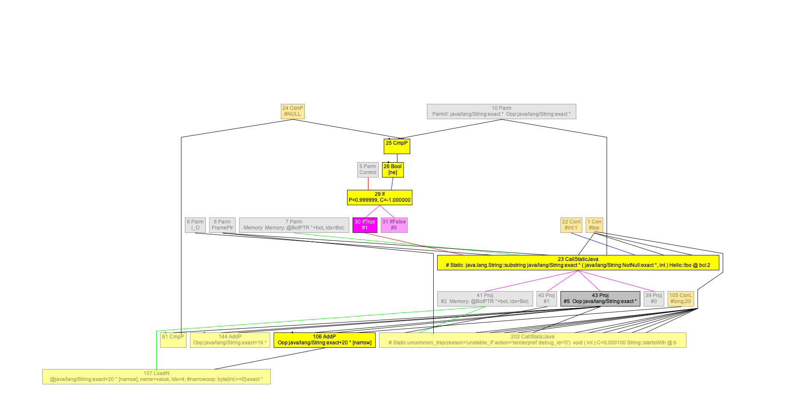
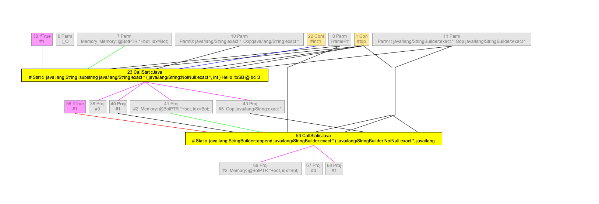

# Java Substring Opto

## Introduction

String.substring creates a new String object since jdk7. Collecting substring objects has been the job of garbage collectors since then. Otherwise, library and application developers may cause memory leaking by holding reference of parent strings. 

### Idiomatic use of substring

1. substring|startsWith pair

```
 public static boolean foo(String s) {
  return s.substring(1).startsWith("a");
 }
```



We’d like to introduce a technique called “API simplification”. C2 can roughly translate the pair to the following snippet. It’s not high-fidelity, but it’s close. 

```
 public static boolean foo(String s) {
  if("a".length() > s.length() - 1) return false;
  return s.startsWith(prefix, 1);
 }
```

https://github.com/navyxliu/StringFunc/blob/master/src/com/amazon/jdkteam/brownbag/SubstringAndStartsWith.java#L46

Microbench suggests the throughput increases 2~12x when the length of substring ranges from 1 to 512. The gc allocation rate can reduce down to zero.

This transformation reveals the potential of inter-procedural opportunity. Except intrinsics, C2 is not aware of any method of JRE. It can’t change any method automatically unless programmers tell it. If C2 late-inlines **String.substring** and **String.startsWith**, it could detect this pattern and simplify it. 

2. substring|StringBuilder.append

```
 public static void toSB(String s, StringBuilder sb) {
  sb.append(s.substring(1));
 }
```



Similar to the prior example, we can use API simplification to get:

```
 public static void toSB(String s, StringBuilder sb) {
   sb.append(s, 1, s.length());
 }
```

https://github.com/navyxliu/StringFunc/blob/master/src/com/amazon/jdkteam/brownbag/SubStrToStringBuilder.java#L39

3. String.split() and pick one

```
public static String splitAndUse(String path) {
 return path.split("/")[0];
}
```

It’s not uncommon to see Java programmers split a long string but only use a couple of results. If path can split into thousands of components, JavaVM actually returns an array filled with thousands of new substrings. Without inter-procedural analysis, C2 has no idea that only a small fraction of result are used.

String.split() provides a less popular overloaded method split("regex", limit), which throttles the resulting array. After Inlining and constant propagation, C2 can infer the maximal index which accesses path.split("/"). If it is a constant, C2 can make use of the overloaded version of split().

```
public String static splitAndUse(String path) {
 return path.split("/", 1/*limit*/)[0];
}
```

https://github.com/navyxliu/StringFunc/blob/master/src/com/amazon/jdkteam/brownbag/SplitAndPick.java#L62

### General solution outliner

Technically speaking, JVM can waive all substring allocation if they are not escaped from the current method. C2 has to postpone to inline **String.substring** after Escape analysis to have the information.

More aggressively, C2 can find all uses of String.value and change them to (BaseString.value + beginIdex). If this substring eventually escapes from fieldstore, return or callsite, it must retain at least one use. If this object is not escaped, optimizers of c2 can delete all nodes of String.substring() after inlining.
